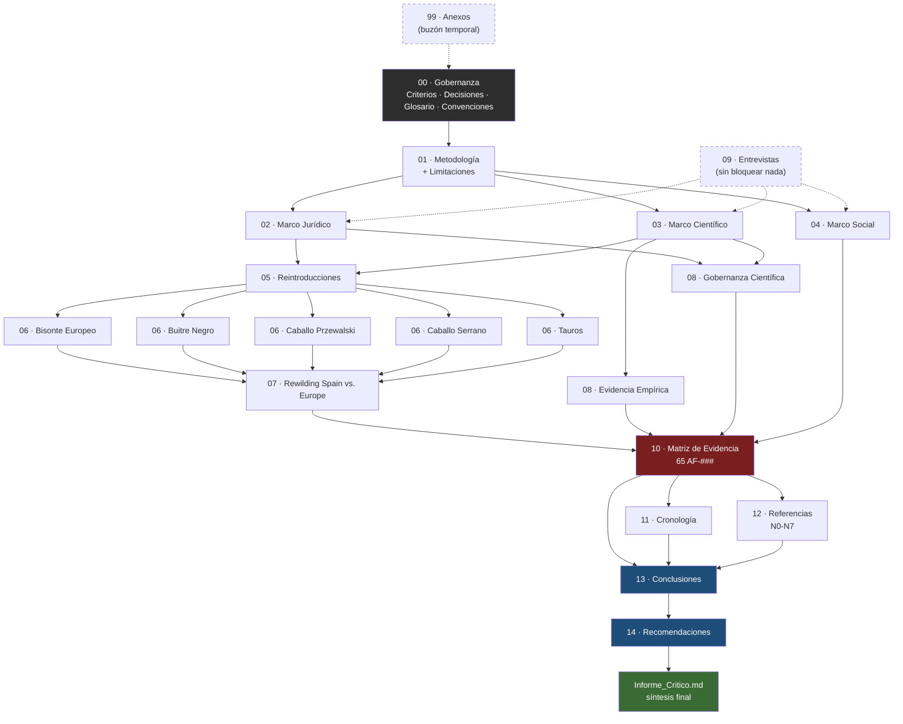

# Mapa del Repositorio

> Diagrama Mermaid — se renderiza automáticamente en la vista de lectura de
> Obsidian. No es contenido citable; es navegación visual.

## Lectura del diagrama

- **Flechas sólidas** = dependencia real (`depende_de` en la cabecera YAML).
- **Flechas punteadas** = relación informativa, no bloqueante (Entrevistas y
  Anexos no figuran en el `depende_de` de ningún capítulo, Criterios §10).
- **Nodo rojo** (Matriz) = punto de convergencia obligado — todo hallazgo pasa
  por ahí antes de llegar a Conclusiones.
- **Nodos azules** (Conclusiones, Recomendaciones) = los dos capítulos nuevos,
  con la regla dura de separación entre "qué muestra la evidencia" y "qué se
  propone hacer al respecto".

---
*Actualizar este diagrama cada vez que se añada o reordene un capítulo — mismo
riesgo de desincronización ya detectado antes en `README.md` e
`Informe_Critico.md`.*
